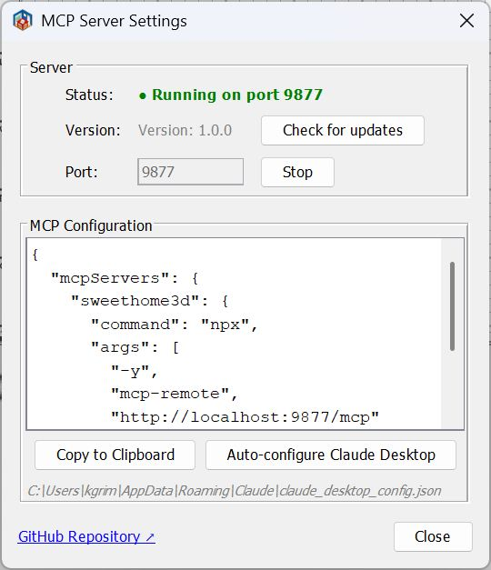

# Sweet Home 3D MCP Plugin

[](LICENSE)
[](https://adoptium.net/)
[](https://www.sweethome3d.com/)

A plugin for [Sweet Home 3D](https://www.sweethome3d.com/) that embeds an MCP (Model Context Protocol) server directly inside the application. Lets Claude and other AI assistants control Sweet Home 3D over HTTP — create walls, place furniture, render photos, and more — without any external proxy or separate server process.

```
Claude Desktop / Claude Code
         │  HTTP (JSON-RPC 2.0)
         ▼
┌─────────────────────────────────────┐
│  Sweet Home 3D  +  MCP Plugin       │
│  Built-in HTTP server on port 9877  │
│  http://127.0.0.1:9877/mcp         │
└─────────────────────────────────────┘
```

## Screenshot



## Requirements

| Requirement | Version |
|-------------|---------|
| [Sweet Home 3D](https://www.sweethome3d.com/download.jsp) | 6.0 or newer |
| Java (bundled with SH3D or system) | 11 or newer |

> **Note:** Sweet Home 3D ships with a bundled JRE. Make sure it is Java 11+. Very old SH3D builds (32-bit Windows installer with JRE 1.8) will silently fail to load the plugin due to `UnsupportedClassVersionError`.

## Installation

**Step 1.** Download the latest `.sh3p` file from [Releases](../../releases).

**Step 2.** Copy it to your Sweet Home 3D plugins folder:

| OS | Plugins folder |
|----|----------------|
| Windows | `%APPDATA%\eTeks\Sweet Home 3D\plugins\` |
| macOS | `~/Library/Application Support/eTeks/Sweet Home 3D/plugins/` |
| Linux | `~/.sweethome3d/plugins/` |

**Step 3.** (Re)start Sweet Home 3D. The MCP server starts automatically on port `9877`.

> You can verify it is running: **Tools → MCP Server...** shows the server status.

## Claude Configuration

Add to your Claude Desktop `claude_desktop_config.json`:

```json
{
  "mcpServers": {
    "sweethome3d": {
      "type": "http",
      "url": "http://localhost:9877/mcp"
    }
  }
}
```

For Claude Code, create `.mcp.json` in your project directory:

```json
{
  "mcpServers": {
    "sweethome3d": {
      "type": "http",
      "url": "http://localhost:9877/mcp"
    }
  }
}
```

> The plugin also has a built-in **"Auto-configure Claude Desktop"** button in **Tools → MCP Server...** that writes this config automatically.

## Available Commands

42 commands across 12 categories.

### Scene

| Command | Description |
|---------|-------------|
| `get_state` | Full scene state: walls, furniture, rooms, camera, labels, levels |
| `clear_scene` | Remove all objects from the scene |

### Walls

| Command | Description |
|---------|-------------|
| `create_wall` | Single wall between two points |
| `create_walls` | Rectangular room (4 connected walls) |
| `modify_wall` | Change height, thickness, color, arc, coordinates |
| `delete_wall` | Delete wall by ID |
| `connect_walls` | Connect two walls for correct corner rendering |

### Rooms

| Command | Description |
|---------|-------------|
| `create_room_polygon` | Room from an array of polygon points |
| `modify_room` | Change name, floor/ceiling color, visibility |
| `delete_room` | Delete room by ID |

### Furniture

| Command | Description |
|---------|-------------|
| `list_categories` | All furniture catalog categories with item counts |
| `list_furniture_catalog` | Browse catalog; filter by name, category, or type |
| `place_furniture` | Place a catalog item in the scene |
| `modify_furniture` | Move, rotate, resize, recolor furniture by ID |
| `delete_furniture` | Delete furniture by ID |
| `duplicate_objects` | Duplicate one or more objects by ID |
| `group_furniture` | Group multiple pieces into one object |
| `ungroup_furniture` | Split a group back into individual pieces |

### Doors & Windows

| Command | Description |
|---------|-------------|
| `place_door_or_window` | Place from catalog into a wall (auto-computes position and angle) |

### Textures & Appearance

| Command | Description |
|---------|-------------|
| `list_textures_catalog` | Browse texture catalog; filter by name or category |
| `apply_texture` | Apply catalog texture to wall side or room surface |
| `set_environment` | Ground/sky colors, lighting, wall transparency, drawing mode |

### 3D Shapes

| Command | Description |
|---------|-------------|
| `generate_shape` | Create custom 3D geometry: primitives (box, sphere, cylinder, cone, wedge, arch, stairs, torus, hemisphere, pipe), extrude, mesh, and CSG boolean operations (union, subtract, intersect) |

### Annotations

| Command | Description |
|---------|-------------|
| `add_label` | Text annotation on the 2D floor plan |
| `add_dimension_line` | Measurement line with auto-offset |

### Camera

| Command | Description |
|---------|-------------|
| `set_camera` | Switch to top/observer mode; set position, `lookAt` point, or `target` object |
| `store_camera` | Save the current viewpoint as a named bookmark |
| `get_cameras` | List all saved camera viewpoints |

### Multi-level

| Command | Description |
|---------|-------------|
| `add_level` | Add a new level (floor/storey) |
| `list_levels` | List all levels; shows which is currently selected |
| `set_selected_level` | Switch the active level |
| `delete_level` | Delete a level and all its objects |

### Rendering & Export

| Command | Description |
|---------|-------------|
| `render_photo` | Ray-traced 3D render (Sunflow); standard or overhead bird's-eye view; inline JPEG or saved PNG |
| `export_plan_image` | 2D floor plan as PNG |
| `export_svg` | 2D floor plan as SVG |
| `export_to_obj` | 3D scene as Wavefront OBJ (ZIP: OBJ + MTL + textures) |

### Save / Load

| Command | Description |
|---------|-------------|
| `save_home` | Save the scene to a `.sh3d` file |
| `load_home` | Load a `.sh3d` file, replacing the current scene |

### Checkpoints (undo timeline)

| Command | Description |
|---------|-------------|
| `checkpoint` | Save an in-memory snapshot (optional description) |
| `restore_checkpoint` | Restore from a snapshot (supports force mode) |
| `list_checkpoints` | List all snapshots with the current undo cursor position |

### Batch

| Command | Description |
|---------|-------------|
| `batch_commands` | Execute multiple commands in one request |

## Coordinate System

- Units: **centimeters** (500 = 5 meters)
- X axis: right, Y axis: **down** (screen coordinates)
- All object IDs are stable UUIDs — safe to use across multiple calls

## Building from Source

**Prerequisites:** Java 11+, Maven 3.6+ (or use the included `mvnw` wrapper).

```bash
# 1. Clone
git clone https://github.com/grimashevich/sweethome3d-mcp-server.git
cd sweethome3d-mcp-server

# 2. Obtain SweetHome3D.jar (copies from your SH3D installation or downloads it)
./scripts/setup-dev.sh        # macOS / Linux / Git Bash on Windows
# scripts\setup-dev.bat       # Windows Command Prompt

# 3. Build
./mvnw clean package

# 4. Run tests
./mvnw test

# The plugin artifact is at:
# target/sh3d-mcp-plugin-1.0.0.sh3p
```

> **Why the setup script?** `SweetHome3D.jar` is a 46 MB binary excluded from git.
> The script first checks your local Sweet Home 3D installation (fastest, works offline),
> then falls back to downloading from SourceForge.
> The three Java3D JARs (`j3dcore`, `j3dutils`, `vecmath`) are included in `lib/` directly.

## Architecture

The plugin is a single self-contained component with no external runtime dependencies:

- **`plugin`** — Entry point (`SH3DMcpPlugin`), settings dialog
- **`http`** — Streamable HTTP MCP server (JSON-RPC 2.0, port 9877)
- **`command`** — 42 command handlers, auto-registered via `CommandRegistry`
- **`bridge`** — Thread-safe Sweet Home 3D API wrapper (`HomeAccessor` via EDT, `CheckpointManager`, `ObjectResolver`)
- **`protocol`** — Hand-written JSON parser (zero external dependencies)
- **`config`** — Plugin settings, Claude Desktop auto-configurator

See [ARCHITECTURE.md](ARCHITECTURE.md) for the full design, ADR decisions, and sequence diagrams.

## Adding a New Command

One class is all it takes — the registry picks it up automatically:

```java
public class MyCommandHandler implements CommandHandler, CommandDescriptor {

    @Override
    public Response execute(Request request, HomeAccessor accessor) {
        // All Home mutations must run on the Event Dispatch Thread:
        Object result = accessor.runOnEDT(() -> {
            Home home = accessor.getHome();
            // ... do something
            return "done";
        });
        return Response.success(result);
    }

    @Override
    public String getDescription() { return "Does something useful."; }

    @Override
    public Map<String, Object> getSchema() {
        return SchemaBuilder.object()
            .prop("name", "string", "Object name")
            .required("name")
            .build();
    }
}
```

Then register it in `SH3DMcpPlugin.createCommandRegistry()`:

```java
registry.register("my_command", new MyCommandHandler());
```

See [CONTRIBUTING.md](CONTRIBUTING.md) for the full development guide.

## License

GNU General Public License v2.0 — see [LICENSE](LICENSE) for details.

This plugin uses the [Sweet Home 3D](https://www.sweethome3d.com/) Plugin API (GPL v2) and Java3D (BSD / JOGL license).
